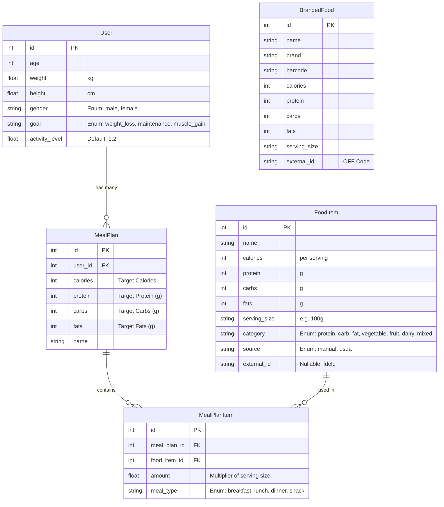

# Nutrition App Database Schema

> [!NOTE]
> This schema is built using [SQLModel](https://sqlmodel.tiangolo.com/), which combines Pydantic and SQLAlchemy.
> The database runs on PostgreSQL (Cloud SQL) in production and SQLite in development.

## Entity Relationship Diagram (ERD)

## Tables

### 1. `access_user` (Table: `user`)
Stores user biometric data and fitness goals.

| Column | Type | Required | Description |
| :--- | :--- | :--- | :--- |
| `id` | Integer | No (PK) | Auto-incrementing Primary Key. |
| `age` | Integer | Yes | User's age. |
| `weight` | Float | Yes | Weight in **kg**. |
| `height` | Float | Yes | Height in **cm**. |
| `gender` | Enum | Yes | `male`, `female` |
| `goal` | Enum | Yes | `weight_loss`, `maintenance`, `muscle_gain` |
| `activity_level` | Float | Yes | TDEE Multiplier (default 1.2). |

### 2. `mealplan`
Represents a generated daily plan for a user, containing nutritional targets.

| Column | Type | Required | Description |
| :--- | :--- | :--- | :--- |
| `id` | Integer | No (PK) | Primary Key. |
| `user_id` | Integer | Yes (FK) | Foreign Key linking to `user`. |
| `name` | String | Yes | Name of the plan (e.g. "Maintenance Plan"). |
| `calories` | Integer | Yes | **Target** daily calories. |
| `protein` | Integer | Yes | **Target** daily protein (g). |
| `carbs` | Integer | Yes | **Target** daily carbs (g). |
| `fats` | Integer | Yes | **Target** daily fats (g). |

### 3. `fooditem` (Table: `fooditem`)
The core catalog of "Whole Foods" (Generic). Sourced from Manual entry or USDA API.

| Column | Type | Required | Description |
| :--- | :--- | :--- | :--- |
| `id` | Integer | No (PK) | Primary Key. |
| `name` | String | Yes | Name of the food/product. |
| `calories` | Integer | Yes | Calories per `serving_size`. |
| `protein` | Integer | Yes | Protein (g). |
| `carbs` | Integer | Yes | Carbs (g). |
| `fats` | Integer | Yes | Fats (g). |
| `serving_size` | String | Yes | Text description (e.g., "100g", "1 cup"). |
| `category` | Enum | Yes | Macro category: `protein`, `carb`, `fat`, `vegetable`, `fruit`, `dairy`, `mixed`. |
| `source` | Enum | Yes | Data provenance: `manual`, `usda`. |
| `external_id` | String | No | USDA FDC ID. |

### 4. `brandedfood` (Table: `brandedfood`)
Separate catalog for branded products from Open Food Facts.

| Column | Type | Required | Description |
| :--- | :--- | :--- | :--- |
| `id` | Integer | No (PK) | Primary Key. |
| `name` | String | Yes | Product name. |
| `brand` | String | Yes | Brand name. |
| `barcode` | String | Yes | UPC/EAN barcode. |
| `calories` | Integer | Yes | Calories. |
| `protein` | Integer | Yes | Protein (g). |
| `carbs` | Integer | Yes | Carbs (g). |
| `fats` | Integer | Yes | Fats (g). |
| `serving_size` | String | Yes | Serving size string. |
| `external_id` | String | No | Open Food Facts code (usually same as barcode). |

### 4. `mealplanitem`
Join table linking a `MealPlan` to specific `FoodItem`s efficiently distributed across meals.

| Column | Type | Required | Description |
| :--- | :--- | :--- | :--- |
| `id` | Integer | No (PK) | Primary Key. |
| `meal_plan_id` | Integer | Yes (FK) | Links to `MealPlan`. |
| `food_item_id` | Integer | Yes (FK) | Links to `FoodItem`. |
| `meal_type` | Enum | Yes | `breakfast`, `lunch`, `dinner`, `snack`. |
| `amount` | Float | Yes | Multiplier of the `FoodItem`'s serving size (e.g. 1.5x). |

## Enums & Types

### FoodCategory
Used for the meal generation algorithm to slot foods into balanced meals.
- `PROTEIN` (Chicken, Beef, Tofu)
- `CARB` (Rice, Oats, Pasta)
- `FAT` (Almonds, Avocado)
- `VEGETABLE` (Broccoli, Spinach)
- `FRUIT` (Banana, Apple)
- `DAIRY` (Yogurt, Cheese)
- `MIXED` (Complex dishes)

### FoodSource
Tracks where the data came from for data quality auditing.
- `MANUAL`: Seeded manually or created by user.
- `USDA`: Imported from USDA FoodData Central (High trust for macros).
- `OFF`: Imported from Open Food Facts (High variety, user-contributed).
